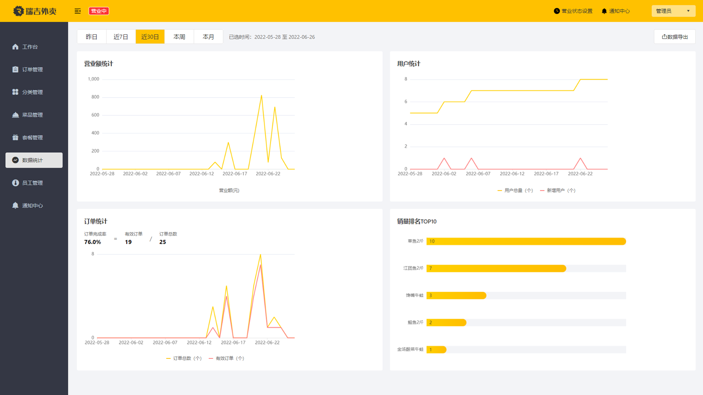

# reggie_parent

#### 介绍
瑞吉外卖项目，一款为餐饮企业打造的在线订餐软件

#### 前端代码
「project-rjwm-admin-vue-ts.exe」
https://www.aliyundrive.com/s/AnRReoe66dQ
双击解压即可  
根目录cmd运行  npm run serve

#### 技术架构

Spring Boot
Mybatis
Mysql
Redis
JWT
Apache POI
Spring Task
阿里云OSS
微信小程序

#### **项目效果展示**

