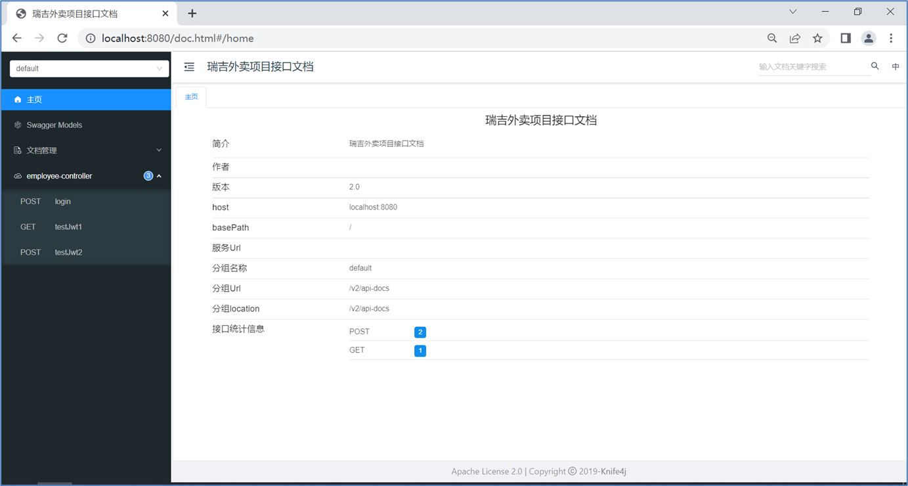
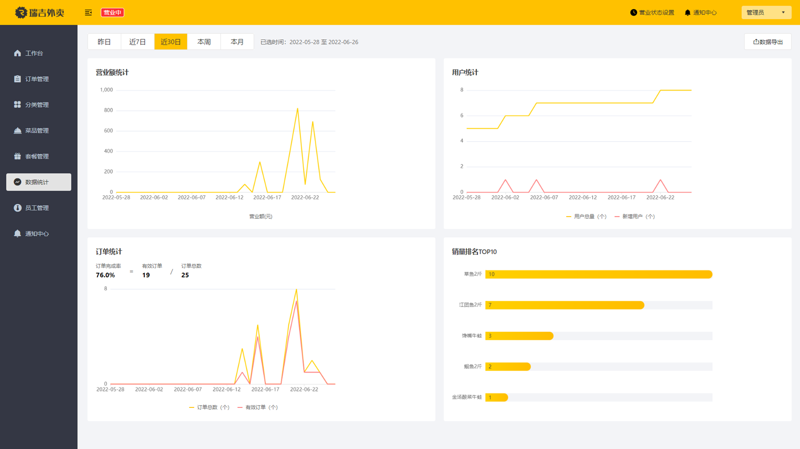
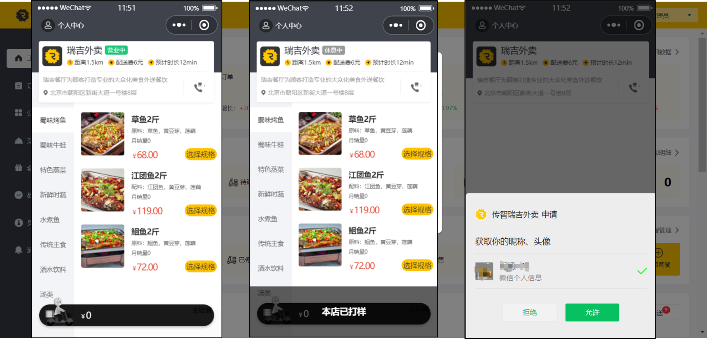

# reggie_parent

## 介绍

瑞吉外卖项目，一款为餐饮企业打造的在线订餐软件  

技术选型

## 技术架构

Spring Boot
Mybatis
Mysql
Redis
JWT
Apache POI
Spring Task
阿里云OSS
微信小程序

## 开发环境

1. JDK 1.8
2. IntelliJ IDEA 2022.1.2
3. Maven 3.6.1
4. Node.js v16.15.1
5. Redis 7.0
6. MySQL 5.6.22

## 前后端分离开发

### 介绍

|          | **开发语言**     | **开发工具**      | **运行环境** | **服务器** |
| -------- | ---------------- | ----------------- | ------------ | ---------- |
| 前端开发 | JavaScript、HTML | VS Code、Hbuilder | Node.js      | Nginx      |
| 后端开发 | Java             | IDEA、eclipse     | JDK          | Tomcat     |

### 前端工程

「project-rjwm-admin-vue-ts.exe」
https://www.aliyundrive.com/s/AnRReoe66dQ
双击解压即可  
根目录cmd运行 npm run serve

访问前端工程，地址：http://localhost:8081

### 后端工程

Swagger  
接口文档访问路径为 http://localhost:8080/doc.html

## **项目效果展示**

管理员展示

小程序展示

